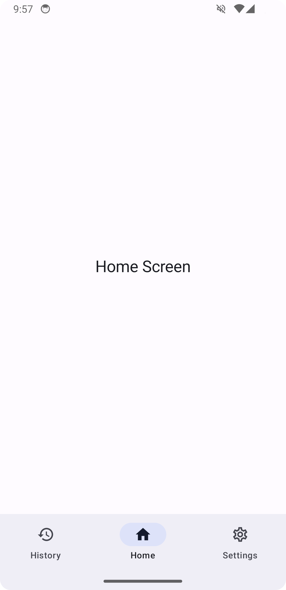
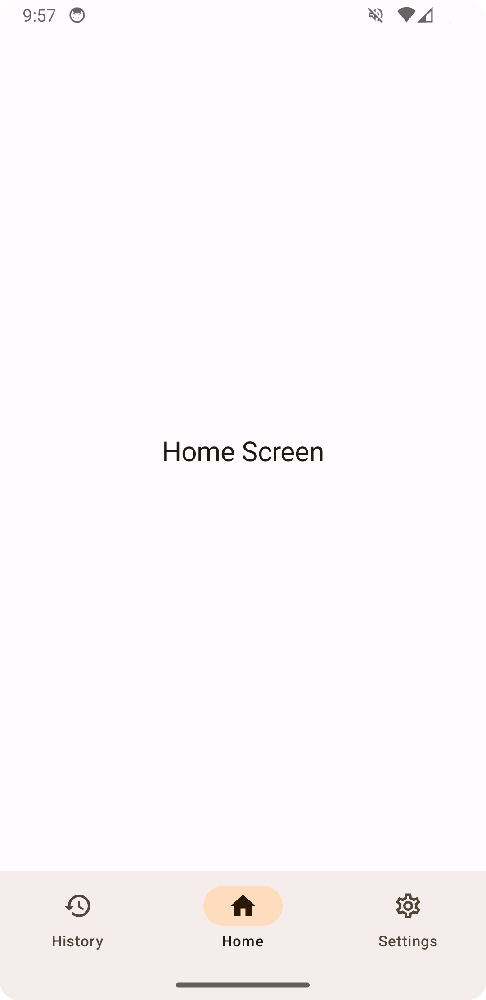
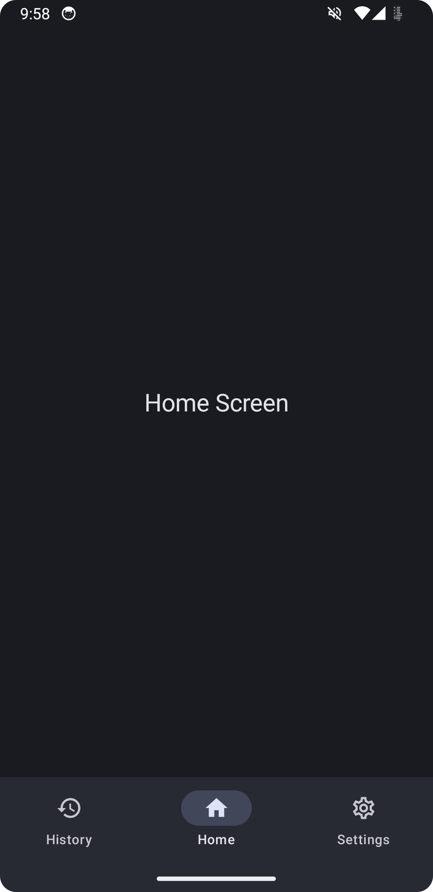
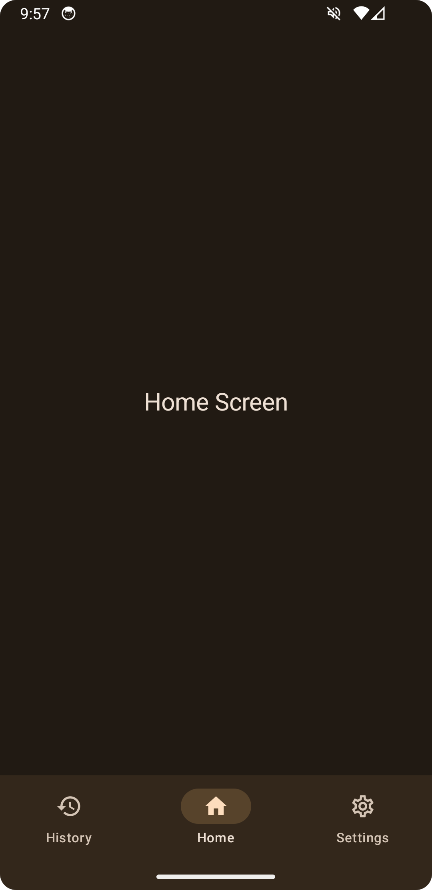

# Features
- Dynamic colors based on the system's color palette
- Showing outlined icon by default and filled icon when selected
- Stays in the correct tab when screen is rebuild
- Handles back gesture and back button correctly

# Preview

  
  
  
  

